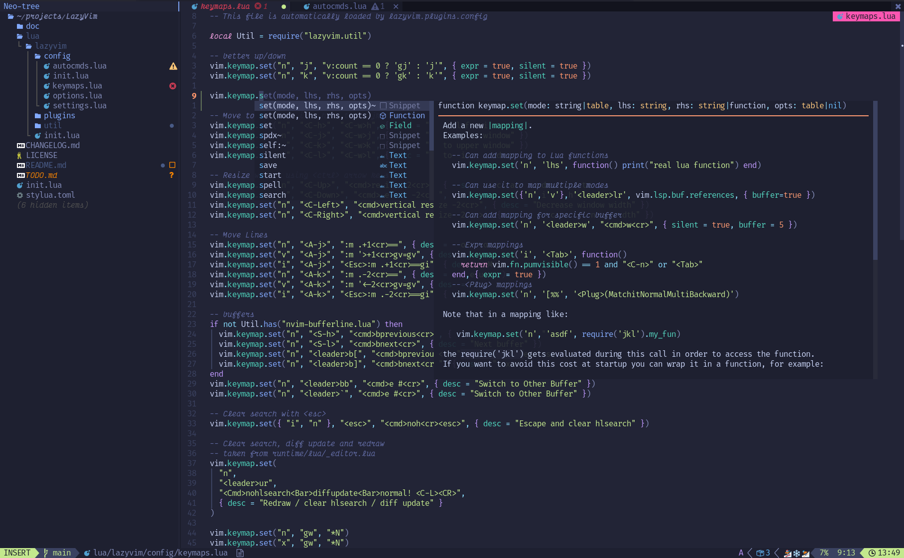

Over the past few years, I’ve gradually moved away from **mouse-driven interfaces**.
What began as a small experiment has turned into a **complete shift in how I work**.

The tools I discovered didn't just imitate the old way of doing things, **they made them better**. My workflow became **faster**, **more focused**, and even **enjoyable**.

In this post, I’ll share the **tools** and **habits** that helped me make the switch, and why they might give you the **productivity boost** you didn’t even know you were missing.

## kitty

The **terminal** is the natural habitat of a programmer, so having a **good one** is essential.


[**`kitty`**](https://sw.kovidgoyal.net/kitty) isn't the only option out there, but it’s the one I’ve found to offer the **richest set of features**:

- ⚡ GPU acceleration
- ✨ Ligature support
- 🖼️ Image rendering
- 🎯 Cursor trailing
- 🌐 Native Wayland support
- 😾 A famously grumpy developer

Of course, there are other excellent options worth mentioning: [**WezTerm**](https://wezterm.org) with a **fantastic community** but still **shaky Wayland support**, and [**Ghostty**](https://ghostty.org) which looks **very promising** but still **needs time** to fully mature.

## Zellij


At its core, [**Zellij**](https://zellij.dev) is a **terminal multiplexer**, that lets you **split panes** and use **tabs**, but its real magic relies in its **session management**.

Unlike the endless tab chaos you get in a normal terminal, Zellij lets you **name**, **switch**, and even **resurrect full workspaces: panes, tabs, running programs and all**.
It’s like bookmarking an entire workflow and picking it up exactly where you left off.


Some of you may already know [**`tmux`**](https://github.com/tmux/tmux/wiki).
While it’s older and stable, it can feel a bit **old-school** and **config-heavy**.

Zellij, on the other hand, is **approachable** and **user-friendly**.
It comes with **sensible defaults**, a built-in **status bar**, and **plugin support**, so you don’t need to wrestle with a long `.tmux.conf` file to get rolling.

Written in **Rust**, it’s **fast** and **reliable**, works smoothly across machines, and offers a **modern**, **portable**, "just works" setup for managing **real terminal sessions**.

## yazi


Why settle for **Dolphin** when [**Yazi**](https://yazi-rs.github.io) brings all the power straight to your terminal? 

Yazi is a **terminal file manager** that makes working with files feel fast, smooth, and modern.
Instead of just giving you a bare-bones interface, it comes packed with features that make everyday file management a lot more powerful:

- 📂 **Multi-panel layout** with **Vim-like keybindings** for intuitive navigation
- 🔍 **Fuzzy search** to jump to files and directories instantly
- 🖼️ **Previews for images, PDFs, and code** (with syntax highlighting) right inside the terminal
- ⚡ **Batch operations** that make moving, copying, and deleting files effortless
- 🔌 **Plugin system** for extending functionality to fit your workflow
- 🔄 **Async operations** so browsing big directories or remote paths never slows you down

 <!-- TODO: move to public/ -->

Compared to other terminal file managers, Yazi really shines.
[**`lf`**](https://github.com/gokcehan/lf) (my previous lovebird) is **minimal but spartan**, [**`ranger`**](https://ranger.fm) is **flexible but feels heavy**, [**`mc`**](https://midnight-commander.org) (Midnight Commander) is **classic but dated**, and [**`nnn`**](https://github.com/jarun/nnn) is **lean but stripped down**.
Yazi blends the best of all worlds: **speed**, **modern features**, and **thoughtful defaults** that let you get **productive immediately**.

## lazyvim

After growing tired of [**VS Code**](https://code.visualstudio.com) feeling like a **browser wrapped around a text editor**, I began my journey into [**Vim**](https://www.vim.org).


I quickly fell into the **customization rabbit hole** and watched the ecosystem evolve: from [**`vim-plug`**](https://github.com/junegunn/vim-plug) to [**`packer.nvim`**](https://github.com/wbthomason/packer.nvim) to [**`lazy.nvim`**](https://github.com/folke/lazy.nvim), circling back to Neovim’s **built-in plugin manager**.
From [**`coc.nvim`**](https://github.com/neoclide/coc.nvim) to the built-in [**LSP**](https://microsoft.github.io/language-server-protocol) support, and of course the [**Tree-sitter**](https://tree-sitter.github.io/tree-sitter) revolution.
It was powerful, but also **too much configuration**.

Enter [**LazyVim**](https://www.lazyvim.org), a polished **Neovim distribution** that proves you don’t need a heavyweight IDE to get things done.
It comes fully configured with **sensible defaults**, **preloaded plugins**, and **smart keybindings**, so you can start editing right away without spending hours tinkering.


With **LazyVim**, you’re not giving up any of the essentials you’d expect from **VS Code**:

- 🧩 **LSP support** for completions and diagnostics
- 🔍 **Fuzzy file and symbol search**
- 🌳 **Tree-sitter–powered syntax highlighting**
- 🔧 **Git integration**

The difference is that LazyVim delivers all of this with **blazing speed** in a lightweight, **terminal-native environment**, plus the **flexibility of Neovim customization** already set up for you.



If you love the **speed** and **flexibility** of Neovim but don’t want to spend weeks configuring it, **LazyVim hits the sweet spot**.

## LazyGit

**LazyGit** is a **terminal-based interface** that makes managing your repositories **fast**, **visual**, and surprisingly **intuitive**.
With it, you can **stage changes**, **commit**, **switch branches**, **resolve conflicts**, and even **handle stashes**, all without typing a single long Git command.


Tired of endlessly clicking around in the **GitHub UI** looking for the right option?
LazyGit is **snappier**, keeps you **right in the terminal**, and gives you **instant feedback** on your repository’s state.
It doesn't try to replace Git; it makes Git **easier to navigate**, letting you **focus on coding** instead of chasing commands.

If you love the **speed of the terminal** but want a friendly, **visual way to manage Git**, **LazyGit is the perfect companion**.

## LazyDocker

Managing [Docker](https://www.docker.com) containers in the terminal can feel like a juggling act with all the commands and context switching.
[**LazyDocker**](https://github.com/jesseduffield/lazydocker) makes it easier by providing a **visual, interactive interface** right in your terminal. You can **view containers, images, volumes, and networks**, start or stop containers, follow logs, and even **manage Docker Compose projects** without typing long Docker commands.


Compared to [**Docker Desktop**](https://www.docker.com/products/docker-desktop), LazyDocker is **lightweight**, **fast**, and works entirely in the terminal, making it perfect for remote servers or minimal setups.
You get all the essential functionality while gaining **speed, simplicity, and a cleaner workflow**.

If you like the control of the terminal but want a **friendly dashboard for Docker**, **LazyDocker makes container management effortless**.

## kulala


[**Kulala**](https://neovim.getkulala.net) is a **minimal yet powerful REST client** that makes testing APIs fast, smooth, and surprisingly intuitive.
You can **send HTTP requests**, organize them with the **HTTP file format**, use **environment variables**, and even write **scripts to automate repetitive tasks** all without leaving your editor.

For example, you could define some variables and send a basic **JSON request** like this:

```http
@url = https://api.example.com
@token = api_token

POST {{url}}/users
Authorization: Bearer {{token}}
Content-Type: application/json

{
  "name": "Alice",
  "email": "alice@example.com"
}
```

And **responses** from a request can even be used as **variables** to others:

```http
# @name TOKEN_REQUEST

POST {{url}}/tokens/authentication
Content-Type: application/json

{
	"email": "alice@example.com",
	"password": "pa55word"
}

###

GET {{url}}/healthcheck
Authorization: Bearer {{TOKEN_REQUEST.response.body.authentication_token.token}}
```

Compared to [**Postman**](https://www.postman.com), Kulala is **lightweight, fast, and fully integrated with the editor**.
You still get **autocompletion, syntax highlighting, and environment management**, but without the overhead of a heavy GUI.
It keeps you focused on your code and your APIs instead of switching between windows.


## Conclusion

This is basically **how I stopped worrying and learned to love the terminal**.

I truly hope these tools make your workflow easier and more efficient.
And if you come across any new, shiny tools, **I’d love to hear about them** 😄.

Stay tuned for **part two**!
