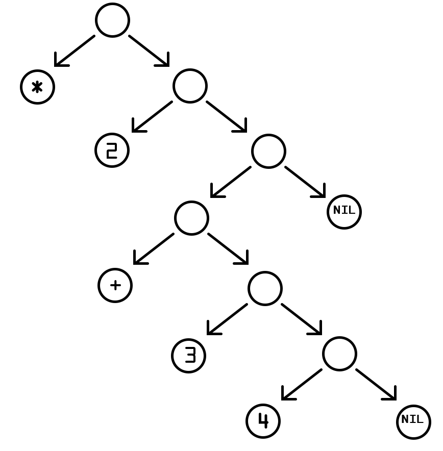

## Table of Contents


Recently, I've been teaching **Programming Paradigms** at my university.
The course is designed to give students a broad view of the three most influential paradigms in modern programming.

For each paradigm, we use a language that best represents its philosophy:

- 📦 **Object-Oriented Programming** with **Smalltalk Pharo**
- ➗ **Functional Programming** with **Haskell**
- 🧠 **Logic Programming** with **Prolog**


Learning the syntax of different languages is valuable, but it comes with a challenge.
Students are not only switching between **interfaces and syntaxes**, they are also absorbing **entirely new ways of thinking** about programming.
And they must do this repeatedly throughout the four months of the course.

One idea has been floating around for years, but it was never taken seriously:

> **What if we used a single language that supports all three paradigms natively?** 🤔

The difficulty lies in finding such a language while still **preserving the essence** of each paradigm.
At first, this seems impossible.
Yet there is a solution close at hand.
It could even open the door to a **fourth paradigm** at the same time.

💡 That **solution** is

## The power of LISP


**Lisp** (short for "**Lis**t **P**rocessing") is a **family of programming languages** sparked from **John McCarthy**'s research on **symbolic computation** in 1958.
The original implementation is the **second oldest** high-level language, closely after **Fortran**.

[Paul Graham](https://en.wikipedia.org/wiki/Paul_Graham_(programmer)) identified nine **important aspects** of Lisp that **distinguished** it from existing languages like **Fortran**. The **most relevant** for our adventure now are:

- **First-class functions**, that can be **passed** as arguments, **returned** from a function, and **stored** in variables.
- **Recursion**, meaning functions can **call themselves** to solve problems.
- **Programs made entirely of expressions** with no statements.
- A **symbol data type**, distinct from the string data type.
- Notation for **code as trees of symbols**, with **S-expression** using numerous **parentheses**.
- **Full language functionality** available at **load**, **compile** and **run time**.

For completion, the other historical ones are:

- **Conditionals beyond `goto`**, such as `if` or `cond`.
- **Variables treated as references** (pointers), with **types determined by value**.
- **Garbage collection** allowing **automatic memory management**.

Over time, a language as old as Lisp has produced many **dialects** and **variants**.
Each took its own approach while **preserving** the **core essence** of their common ancestor.


Today, the most **widely used** Lisp is likely **Clojure**.
Because it runs on the **JVM**, it can tap into the **Java ecosystem**, and its community strives to align with **functional programming** principles to enhance stability.

Although Clojure is my favorite Lisp, our focus here will be placed on **Racket**.
Originating from the **Scheme** dialect, it was built as a platform for **programming language design** and **implementation**, which is why many describe it as the **Programmable Programming Language**.
The meaning of this claim will become clear later, trust me.

### Racket

Generally, Lisp code is made of **S-expressions** (or **symbolic expressions**), which are either **atoms** (numbers, strings, booleans, symbols, etc.) or **lists** (parenthesized sequences of S-expressions).

```racket
#lang racket

;; atoms
42
"hi"
#t
'a-symbol-literal

;; lists
(1 2 3)
("a" "b" "c")
(a b (c d) 5)
```

Under the hood, lists are **chains of pairs** (a.k.a. **`cons` cells**) like **linked lists**.

```racket
(cons 1 (cons 2 (cons 3 '())))  ; the same as '(1 2 3)
```

Because lists are built from pairs, you can retrieve the **first** element (the "head") with `car`, and the **rest** with `cdr`.
These operators are often called `first`/`rest` or `head`/`tail` in other high-level languages.

```racket
(car '(1 2 3))  ; -> 1
(cdr '(1 2 3))  ; -> '(2 3)
```

**Most code is written as S-expressions**, a list where the **first** element is the **operator** and the **rest** are **arguments**, like a **procedure application**.

```racket
(+ 1 2 3)                    ; apply + to 1, 2 and 3 -> 6
(string-append "ra" "cket")  ; -> "racket"
```

Not every list denotes a procedure call, some begin with a **keyword** (a **special form**) that has its own evaluation rules.
For example:

```racket
(define x 10)         ; binding form (special form), not a function call
(lambda (n) (+ n 1))  ; creates an anonymous function (special form)
```

<details>
<summary>Because code is made of expressions, you can nest it, forming something resembling an AST (Abstract Syntax Tree).
</summary>


</details>

```racket
(* 2 (+ 3 4))  ; -> 14
```

When you prefix an expression with a **quote** (`'`), Racket doesn't evaluate it, instead it treats it as **literal data**.
Notice that although the surface **syntax is identical** to runnable code, the leading **quote** changes only the **interpretation**, treating the expression as data rather than something to execute.

```racket
'(+ 1 2 3)      ; a list of data: the symbol '+ and numbers 1 2 3
'(define x 10)  ; data describing some code, but not executed
```

You can inspect the data structure programmatically.

```racket
(list? '(+ 1 2 3))        ; is this a list? -> #t
(symbol? (car '(+ 1 2)))  ; is the first element the symbol '+? -> #t
```

In summary, here's what **code vs data** look like:

```racket
#lang racket

;; data
'(+ 1 (* 2 3))  ; -> (list '+ 1 (list '* 2 3))

;; code
(+ 1 (* 2 3))  ; -> 7
```

Finally, the **first line** `#lang racket` is the **language declaration**: it tells Racket how to read, expand, and run the rest of the file.
Different `#lang`s provide different surface syntaxes and libraries.
Here we are using the **full Racket language**, but later we will pick another flavour of Racket that better suit the paradigm used.

## Object-Oriented Programming

Let's use this **Class Diagram** to illustrate the migration from one language to the other.


We'll start with a simple **hierarchy** of bikes:

- A **base class** `Bike`.
- **Two subclasses**:
  - `Scooter`, where the final price is the **base price multiplied by a coefficient**.
  - `Electric`, where the final price depends on the **battery type**:
    - `250,000` for **lithium batteries**.
    - `120,000` for **lead batteries**.
    - `500,000` for **anything else**.

We also define a `Dealership` class, which contains a **collection of bikes** and adds some **business logic**:

- Get the brand of the **first bike with a lithium battery**.
- Count the **number of scooters** whose **base price** is **within a given range**.

### Defining the Base Class

We should begin implementing the `Bike` class, since it's the only one with **no dependencies**.

```smalltalk
Object << #Bike
  slots: { #brand . #origin };
  package: 'Vehicles'

Bike >> initialize
  super initialize.
  brand := 'Yamaha'.
  origin := 'Japan'

Bike >> brand
  ^ brand

Bike >> brand: aString
  brand := aString

Bike >> origin
  ^ origin

Bike >> origin: aString
  origin := aString

Bike >> finalPrice
  ^ self subclassResponsibility
```

Here we define two attributes (`brand`, `origin`) and a **placeholder method** `finalPrice`, marked abstract using `subclassResponsibility`, whose **implementation is left to subclasses**.

In Racket, we usually start by declaring an **interface**.

```racket
(define Bike<%>
  (interface ()
    get-brand
    set-brand!
    get-origin
    set-origin!
    get-final-price))
```

- The `<%>` **suffix** indicates an **interface**.
- Methods ending in `!` are **mutators** (state-modifying), a strong Racket convention.

Now the class itself (by convention they **end in `%`**).

```racket
(define Bike%
  (class* object% (Bike<%>)
    (init-field [brand "Yamaha"] [origin "Japan"])

    (super-new)

    (define/public (get-brand) brand)
    (define/public (set-brand! b) (set! brand b))

    (define/public (get-origin) origin)
    (define/public (set-origin! o) (set! origin o))

    (abstract get-final-price)))
```

- `class*` takes a **parent class** (`object%`) and a **list of interfaces** (`Bike<%>`).
- `init-field` declares fields with optional **default values**.
- `define/public` declares **public methods** (our getters and setters).
- `abstract` marks methods that must be **implemented in subclasses**.

### Defining subclasses

We actually don't need to use interfaces, so to define the `Scooter` subclass I will **just inherit** from `Bike%`

```racket
(define Scooter%
  (class Bike%
    (init-field [base-price 0] [coefficient 1.0])

    (super-new)

    (define/public (get-base-price) base-price)
    (define/public (set-base-price! b) (set! base-price b))

    (define/public (get-coefficient) coefficient)
    (define/public (set-coefficient! c) (set! coefficient c))

    (define/override (get-final-price) (* base-price coefficient))))  ; final price = base × coefficient
```

- We use `class` (not `class*`), since **no interfaces** are added.
- `define/override` implements the **abstract method** from `Bike%`.

---

The `Electric` subclass **differs** only in how it calculates **the price**.

```racket
(define Electric%
  (class Bike%
    (init-field [battery-type 'lithium])

    (super-new)

    (define/public (get-battery-type) battery-type)
    (define/public (set-battery-type! b) (set! battery-type b))

    (define/override (get-final-price)
      (case battery-type
        ['lithium 250000]
        ['lead 120000]
        [else 500000]))))
```

Here we use `case`, a convenient **pattern-matching form**.

### The `Dealership` Class

First let's tackle the **structure** of our `Dealership` class.

```smalltalk
Object << #Dealership
  slots: { #name . #bikes };
  package: 'Vehicles'

Dealership >> initialize
  super initialize.
  name := 'BikeWorld'.
  bikes := OrderedCollection new

Dealership >> addBike: aBike
  bikes add: aBike
```

We represent the collection of bikes as a list.
Adding a bike is done with `cons`, which adds an element to the **front of a list**.

```racket
(define Dealership%
  (class object%
    (init-field [name "BikeWorld"] [bikes '()])

    (super-new)

    (define/public (get-bikes) bikes)
    (define/public (add-bike bike) (set! bikes (cons bike bikes)))))
```

#### Intermission (How Racket Handles Message Passing)

Before diving into the business logic, let's pause to understand how Racket handles **message passing**.

In Racket's class system, you **invoke a method** on an object with `send`.

```racket
(send <object> <method-name> arg ...)
```

So in our domain we could write something like this:

```racket
(send d add-bike (new Scooter% [brand "Vespa"] [base-price 1000] [coefficient 1.2]))
(send bike get-final-price)
```

We can also use `send` with `this` (the **current instance**) to call another method of the **same object**, or `super` to call the **superclass's version**.

```racket
(define/public (price-with-tax)
  (define price (send this get-final-price))
  (* price 1.21))
```

#### Get the brand of the first bike with a lithium battery

In Pharo, this method **detects** the first electric bike with a lithium battery and returns its brand.

```smalltalk
Dealership >> getBrandFirstLithium
  ^ bikes
    detect: [ :bike |
      (bike isKindOf: Electric)
        and: [ bike batteryType = 'lithium' ] ]
    ifFound: [ :bike | bike brand ]
    ifNone: []
```

To migrate this to Racket we use the `for/first` form, which **iterates over a list** and returns the **first value** for which the body is not `#f`.
`is-a?` checks **class membership** to avoid calling the **wrong method** at runtime.

```racket
(define/public (get-brand-first-lithium)
  (for/first ([bike (in-list bikes)]
              #:when (and (is-a? bike Electric%) (eq? (send bike get-battery-type) 'lithium)))
    (send bike get-brand)))
```

#### Count scooters within a price range

Finding this value in Pharo **reads almost like English**.
We **select** all the bikes with a base price between two values, and then we retrieve the **size** of the resulting collection.

```smalltalk
Dealership >> countScootersBetween: minimum and: maximum
  ^ bikes
    select: [ :bike |
      (bike isKindOf: Scooter)
        and: [ bike basePrice between: minPrice and: maxPrice ] ]
    size
```

In Racket, we can use `for/sum` to **iterate over the list** and **sum** up `1` for each bike that meets the criteria.

```racket
(define/public (count-scooters-between minimum maximum)
  (for/sum
    ([bike (in-list bikes)])
    (if (and (is-a? bike Scooter%) (<= minimum (send bike get-base-price) maximum)) 1 0)))
```

### Putting it all together

Here's a quick demo:

```racket
(define d (new Dealership%))

(send d add-bike (new Scooter% [base-price 50000] [coefficient 1.2]))
(send d add-bike (new Electric% [brand "Tesla"] [battery-type 'lithium]))

(displayln (send d get-brand-first-lithium))  ; "Tesla"
(displayln (send d count-scooters-between 40000 60000))  ; 1
```

Despite **different syntax, idioms and conventions**, we can appreciate many OOP concepts both in Racket and Pharo.
The main **pain point** here is losing how **close to natural language** Smalltalk reads, but the concepts are surprisingly similar.

## Logic Programming

Here I created a small use case to showcase **Logic Programming**.

This is the **foods**, table:

| Code | Name   | Stock | Branch | Category        |
|:----:|--------|------:|-------:|-----------------|
| 1    | Milk   | `200` | `1`    | Dairy, Drink    |
| 2    | Donut  | `120` | `2`    | Bakery          |
| 3    | Yogurt | `75`  | `3`    | Dairy           |
| 4    | Coffee | `50`  | `1`    | Drink, Imported |

Here we got the **branches** table:

| Code | Name    |
|:----:|---------|
| 1    | Central |
| 2    | East    |
| 3    | West    |

And finally, this is the **orders** table:

| Code  | Food | Carrier | Date         | Quantity | Price    |
|:-----:|-----:|---------|--------------|---------:|---------:|
| 1     | `2`  | Anne    | `10/12/2025` | `120`    | `1,000`  |
| 2     | `3`  | Peter   | `05/15/2025` | `40`     | `22,000` |
| 3     | `1`  | Lucy    | `07/20/2025` | `35`     | `17,300` |
| 4     | `4`  | John    | `03/25/2025` | `60`     | `50,000` |

The objective is to write **two rules**:

- Find **all the orders** of **May** where the **stock** is already **above `100`**, and also show the **unitary price** of the food.
- Find for a **certain category**, **all the foods** stored in the **Central branch** whose **stock** is **below `100`**.

### Defining the facts

Translating this to **Prolog**, is just a matter of writing down the statements.

```prolog
%! food(+Code:int, +Name:atom, +Stock:int, +Branch:int, +Categories:list(atom)) is det.
food(1, 'Milk',  200, 1, ['Dairy', 'Drink']).
food(2, 'Donut', 120, 2, ['Bakery']).
food(3, 'Yogurt', 75, 3, ['Dairy']).
food(4, 'Coffee', 50, 1, ['Drink', 'Imported']).

%! branch(+Code:int, +Name:atom) is det.
branch(1, 'Central').
branch(2, 'Este').
branch(3, 'Oeste').

%! order(+Code:int, +Food:int, +Carrier:atom, +Date:date, +Quantity:int, +Price:int) is det.
order(1, 2, 'Anne',  date(5, 12, 2025), 100,  1000).
order(2, 3, 'Peter', date(7, 15, 2025), 150, 22000).
order(3, 1, 'Lucy',  date(9, 20, 2025), 200, 17300).
order(4, 4, 'John',  date(2, 25, 2025), 50,  50000).
```

The comments over the facts follow the **PlDoc** specification, a structured comment format that documents Prolog code.
It describes **predicates**, their **arguments**, expected **types**, input/output **modes**, and **determinism**, to generate **browsable HTML docs**.

The predicate **headers** start with `%!` (or `%%` for private predicates).
Next, argument **modes** describe how each argument **should be used**:

- `+` means it is an **input** variable that must be instantiated when calling.
- `-` means it is an **output** variable that will be bound by the predicate.
- `?` means it is **either** an input or output variable.

Then we declare the variable **type** with type specifiers (`int`, `atom`, `string`, `list(T)`, etc.).
And lastly, we document the **determinism**, or how many solutions the predicate may produce:

- `is det.` means the predicate is deterministic: it produces exactly **one solution**, without choice-points.
- `is semidet.` means it **succeeds once or fails**.
- `is multi` means it produces **one or more solutions**.

---

To approach this in **Racket**, first we need to require the embedded Prolog engine.

```racket
#lang racket
(require racklog)
```

Once that's done, we can start writing **facts** in a similar fashion.

```racket
(define %food
  (%rel (Code Name Stock Branch Categories)
        [(1 'Milk 200 1 '(Dairy Drink))]
        [(2 'Donut 120 2 '(Bakery))]
        [(3 'Yogurt 75 3 '(Dairy))]
        [(4 'Coffee 50 1 '(Drink Imported))]))

(define %branch (%rel (Code Name) [(1 'Central)] [(2 'East)] [(3 'West)]))

(define %order
  (%rel (Code Food Carrier Date Quantity Price)
        [(1 2 'Anne '(date 5 12 2025) 100 1000)]
        [(2 3 'Peter '(date 7 15 2025) 150 22000)]
        [(3 1 'Lucy '(date 9 20 2025) 200 17300)]
        [(4 4 'John '(date 2 25 2025) 50 50000)]))
```

### The queries

#### Getting all overstocked food of May

Since there is only one food that matches the criteria, the result of the first query should look like this:

```
?- overstocked_may_food(Cod, UnitaryPrice).
Code = 1,
UnitaryPrice = 10.
```

Implementing this in Prolog is a matter of stating the **constrains** of the problem:

```prolog
%! may_overstocked_orders(-Code:int, -UnitaryPrice:number) is multi.
may_overstocked_orders(Code, UnitaryPrice) :-
  order(Code, Food, _, date(5, _, _), Quantity, Price),
  food(Food, _, Stock, _, _),
  Stock >= 100,
  Quantity > 0,
  UnitaryPrice is Price / Quantity.
```

And the translation to Racket is literally the same, with some **syntactic adjustments** to work around Racket's **evaluation system**:

```racket
(define %may-overstocked-orders
  (%rel (code unitary-price food quantity price stock)
        [(code unitary-price)
         (%order code food (_) `(date 5 ,(_) ,(_)) quantity price)
         (%food food (_) stock (_) (_))
         (%>= stock 100)
         (%> quantity 0)
         (%is unitary-price (/ price quantity))]))
```

#### Getting all the understocked food in the Central branch

Here is an example of how the other query should look:

```
?- understocked_food_in_central('Drink', Foods).
Foods = ['Coffee'].
```

And to solve we basically use `findall/3`, which takes:

- A **template**, or how it will fill the resulting list.
- The **goal** that has to be reached.
- The **output** variable to be assigned.

```prolog
%! understocked_food_in_central(+Category:atom, -Foods:list(atom)) is det.
understocked_food_in_central(Category, Foods) :-
  findall(Name,
          ( food(_, Name, Stock, Branch, Categories),
            branch(Branch, 'Central'),
            Stock =< 100,
            member(Category, Categories)
          ),
          Foods).
```

Porting this to Racket is almost trivial:

```racket
(define %understocked-food-in-central
  (%rel (category foods name stock branch categories)
        [(category foods)
         (%bag-of name
                  (%and (%food (_) name stock branch categories)
                        (%branch branch 'Central)
                        (%<= stock 100)
                        (%member category categories))
                  foods)]))
```

### See to believe

Just to be sure we are going to run these queries:

<!-- TODO: -->

```racket
(module+ main
  (printf "example a — may_overstocked_orders:\n")
  (let ([ans (%which (code price) (%may-overstocked-orders code price))])
    (displayln ans)
    (let loop ()
      (define more (%more))
      (when more
        (displayln more)
        (loop))))

  (printf "\nexample b — understocked_food_in_central for 'drink:\n")
  (let ([ans2 (%which (foods) (%understocked-food-in-central 'drink foods))])
    (displayln ans2)
    (let loop ()
      (define more (%more))
      (when more
        (displayln more)
        (loop)))))
```

With this you can see that Logic Programming done in Racket is basically the same as Prolog, albeit minor syntax changes.

## Functional Programming

Now let's explore **Functional Programming**, coming from **Haskell**.

We will imagine a **streaming platform** that offers different **subscription plans**.
The next **table** shows the pricings:

| Code   | Name     | Price   |
|:------:|----------|---------|
| `B`    | Basic    | `1,000` |
| `S`    | Standard | `2,000` |
| `P`    | Premium  | `3,000` |
| `F`    | Family   | `4,000` |

We need to:
<!-- TODO: improve phrasing -->
- **Represent** the table into a function.
- Given a list of plan codes, **count** all planes that have a **specific code**.
- **Filter** the plans **below a price**.

### Encoding

There are actually **three ways** to encode the table in Haskell.
The first is to use **pattern-matching**.

```haskell
planPrice :: String -> Int
planPrice "B" = 1000
planPrice "S" = 1000
planPrice "P" = 1000
planPrice "F" = 1000
planPrice _   = 0
```

The second is to use **guards**.

```haskell
planPrice :: String -> Int
planPrice code
  | code == "B" = 1000
  | code == "S" = 2000
  | code == "P" = 3000
  | code == "F" = 4000
  | otherwise   = 0
```

Nonetheless, both will be **desugared** by the compiler into a **case expression**.

```haskell
planPrice :: String -> Int
planPrice code = case code of
  "B" -> 1000
  "S" -> 2000
  "P" -> 3000
  "F" -> 4000
  _   -> 0
```

---

For these problems we are going to use **Typed Racket**, the language built on top of base Racket that enforces type checking by **changing how code is evaluated**.

```racket
#lang typed/racket
```

Now every function **has** to be annotated.
We saw that the first function takes a `String` as input and returns an `Int` as output.

```racket
(: plan-price (-> String Integer))
```

Then we will complete by following right up with the function **implementation**.

```racket
(define (plan-price codigo)
  (match codigo
    ["B" 1000]
    ["S" 2000]
    ["P" 3000]
    ["F" 4000]
    [_ 0]))
```

### Counting

To count **how many plans do I have with a specific code**, we will use **recursion**.

The **base case** (or **trivial**) is when I have **no plans**, and the answer is obviously `0`.

The **recursive case** basically consists in checking **plan by plan**.
We will take the **first one**, and if the code is the one we are looking for, we **add one** to **how many plans I find in the rest**.
Otherwise we keep searching.

```haskell
countPlans :: [String] -> String -> Int
countPlans [] _ = 0
countPlans (x:xs) code
  | x == code = 1 + countPlans  xs code
  | otherwise = countPlans xs code
```

In Racket there are a couple of other, more **idiomatic ways** (namely `count` or `for/count`), but we will stick to the original implementation.

```racket
(: count-plans (-> (Listof String) String Integer))
(define (count-plans plans code)
  (match plans
    ['() 0]
    [(cons plan tail)
     (if (string=? plan code)
         (add1 (count-plans tail code))
         (count-plans tail code))]))
```

### Filtering

Filtering in Haskell can be done with **list comprehensions**.

```haskell
filtrarPlanes :: [Int] -> Int -> [Int]
filtrarPlanes precios ref = [p | p <- precios, p <= ref]
```

This **elegant** syntax follows **mathematical notation**.

$$
\{\, p \in P \mid p < r \,\}
$$

In Racket we can use the `for/list` form, that reads as follows.

```racket
(: filtrar-planes (-> (Listof Integer) Integer (Listof Integer)))
(define (filtrar-planes precios ref)
  (for/list : (Listof Integer)
    ([p (in-list precios)] #:when (<= p ref))
    p))
```

We can see that Functional Programming, along with **all the other paradigms**, are **well supported** and consistent in Racket.

But what about that beautiful **list comprehension syntax** from Haskell?
Is it **gone forever?**

As you can imagine the answer is **no**.
For that we turn to the defining paradigm of all LISPs:

## Reflective Programming

Racket is a language that gives you **control over its own structure and behaviour**.
Thanks to the powerful **macro system**, you can create **new syntax** that looks and behaves just like built-in features, letting you **design new languages**.

While in most languages, code runs only **after** it's written, with Racket's macros code can also **run while it's being read**.
A macro is a function that **transforms code before it's executed**, by rewriting **syntax objects** into something Racket already understands.

That means you can define **new syntax constructs** without worrying about **variable capture** or **name clashes**.

---

Our goal is **to embed** the Haskell syntax for **list-comprehension**

```haskell
[x * x | x <- [1..10], even x]
```

### Defining an Inclusive Range Function

First, we'll replicate Haskell's syntax for **creating inclusive ranges** (like `[1..10]`)

```racket
(define (.. a b . maybe-step)
  (define step
    (cond
      [(pair? maybe-step) (car maybe-step)]
      [(<= a b) 1]
      [else -1]))
  (cond
    [(zero? step) (error '.. "step must be non-zero")]
    [(and (> step 0) (> a b)) (in-range a a step)]
    [(and (< step 0) (< a b)) (in-range a a step)]
    [(> step 0) (in-range a (add1 b) step)]
    [else (in-range a (sub1 b) step)]))
```

<!-- This supports: -->
<!---->
<!-- - Inclusive endpoints -->
<!-- - Optional steps -->
<!-- - Ascending and descending sequences -->

Here we basically set `step` as the value passed by the caller if present, or set it to `1` or `-1` for ascending or descending ranges.

Then we do a basic validation and go about creating ranges with the `in-range` built-in.

The result can be seen with

```racket
(for/list ([n (.. 10 2 -2)]) n)  ; '(10 8 6 4 2)
```

### Understanding Macros

Macros in Racket are **code transformers**.
They take **syntax as input** and produce **new syntax** that Racket then runs as normal code.

You can think of them as **functions that run before your program does**, but they operate on syntax objects, not data.

The simplest way to write one is with `define-syntax-rule`, which lets you define pattern-based rewrites.
For example:

```racket
#lang racket

(define-syntax-rule (when-not cond body ...)
  (when (not cond) body ...))

(when-not #f (displayln "Runs!"))
```

This macro expands `(when-not cond body ...)` into `(when (not cond) body ...)`.

<!-- TODO: explain evaluation and #' -->

### Tackling the problem

A proposed syntax for list comprehension can be something like this:

```racket
(list-comp (* x x)
           [x <- (.. 1 10)]
           (even? x))
;; '(4 16 36 64 100)
```

If we pay attention we can see that conceptually it is made of:

- The **body** (`(* x x)`) that describes what to produce
- Then **clauses**, that could either be:
  - **Generators**: `[x <- (.. 1 10)]`
  - **Guards**: `(even? x)`

We'll parse clauses and expand these into Racket's built-in comprehension form: the `for*/list` loop.

### Starting from the parts

We'll define a **syntax class** `comp-clause` that understands both generators and guards.
Basically it behaves as a **mini parse**.

Inside a `begin-for-syntax` block (so it **runs at macro-expansion time**):

<!-- TODO: choose better -->
<!-- TODO: explain datum and shit -->

```racket
(begin-for-syntax
  (define-syntax-class comp-clause
    #:attributes (pieces binds?)
    #:datum-literals (<-)

    ;; Generator: [pat <- seq]
    (pattern [pat:expr <- seq:expr]
      #:with tmp (generate-temporary #'pat)
      #:with pieces #'([tmp seq] #:when (match tmp
                                          [pat #t]
                                          [_ #f])
                                 #:do [(match-define pat tmp)])
      #:with binds? #'#t)


    ;; Guard: bare expression
    (pattern g:expr
      #:with pieces #'(#:when g)
      #:with binds? #'#f)))

(begin-for-syntax
  (define-syntax-class comp-clause
    #:attributes (pieces binds?)
    #:datum-literals (<-)

    ;; Generator: [pat <- seq]
    (pattern [pat:expr <- seq:expr]
      #:with tmp (generate-temporary #'pat)
      #:with pieces
      #'([tmp seq]
         #:when (match tmp [pat #t] [_ #f])
         #:do [(match-define pat tmp)])
      #:with binds? #'#t)

    ;; Guard: bare expression
    (pattern g:expr
      #:with pieces #'(#:when g)
      #:with binds? #'#f)))
```

Here's what's happening:

- We define how to parse two clause types.
- Generators create temporary bindings (`tmp`) and use pattern matching.
- Guards just translate into `#:when` filters.
- The `pieces` attribute describes what goes into a `for*/list` comprehension later.
- `binds?` tracks whether any generator was found (so we can handle the case of only guards).

---

Next, we'll need some utility functions that help us flatten and check clause syntax.

So inside the `begin-for-syntax`, after `define-syntax-class`, we'll add:

```racket
(begin-for-syntax
  ;; (define-syntax-class comp-clause
  ;; ...
  ;;       #:with binds? #'#f)))

  (define (flatten-pieces stx-list)
    (apply append (map syntax->list stx-list)))

  (define (any-true? stxes)
    (for/or ([s (in-list stxes)]) (syntax-e s))))
```

<!-- TODO: explain -->

### The solution

Finally we will rely heavily on `syntax-parse`, Racket's advanced macro system.

Basically we:

1. Collect the body and all clauses.
2. Expand the clauses into `for*/list` syntax.
3. Handle the case where no generators are present (guards only).

```racket
(define-syntax (list-comp stx)
  (syntax-parse stx
    [(_ body:expr q:comp-clause ...)
     (define flat (flatten-pieces (syntax->list #'(q.pieces ...))))
     (define has-bind? (any-true? (syntax->list #'(q.binds? ...))))
     (with-syntax ([(clauses ...) flat])
       (cond
         [has-bind?
          #'(for*/list (clauses ...)
              body)]
         [else
          ;; No generators: add a dummy binding so guards-only work
          #'(for*/list ([_ '(#t)]
                        clauses ...)
              body)]))]))
```

At this point, the macro is complete!

### Battle testing it

Let's use Racket's unit tests module to play around with it:

```racket
(module+ test
  (require rackunit)

  ;; simple
  (check-equal? (list-comp x [x <- (.. 1 5)] (even? x))
                '(2 4))
  ;; pairs
  (check-equal? (list-comp (list x y) [x <- '(1 2)] [y <- '(3 4)])
                '((1 3) (1 4) (2 3) (2 4)))
  ;; variables
  (check-equal? (list-comp x [x <- (.. 1 10)] [let ([num 5]) (= num x)])
                '(5))
  ;; only the first part of a pair
  (check-equal? (list-comp a [(list a b) <- '((1 5) (4 2))] (= (+ a b) 6))
                '(1 4))
  ;; constants
  (check-equal? (list-comp 42 (< 1 2))
                '(42))
  ;; 
  (check-equal? (list-comp n [n <- (.. 2 10 2)])
                '(2 4 6 8 10)))
```

And the result:

```text
❯ raco test list-comp.rkt
raco test: (submod (file "list-comp.rkt") test)
6 tests passed
```

### Going further

I hope this showcase can be useful to better understand programming paradigms and the power of homoiconic languages.

As an exercise you could try to extend this rule to add an `unless` guard.

First you would need to declare it into the `#:datum-literals`, and then add a `pattern`.

Have fun trying!
